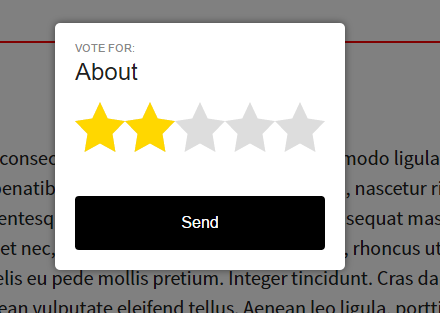
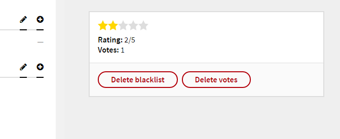

# Kirby Ratings

*Version 0.3*

Ratings stars - Allow users to vote for pages.

- **IP protection** - You can only vote one time on one page.
- **Secret hidden** - code used to prevent simple spam attacks.
- **Page methods** - Get rating average and rating count.
- **Stars snippet** - Show the stars in 4 different sizes in the templates.
- **Multi language** - Including some common languages.



## Installation

Use one of the alternatives below.

### 1. Kirby CLI

If you are using the [Kirby CLI](https://github.com/getkirby/cli) you can install this plugin by running the following commands in your shell:

```
$ cd path/to/kirby
$ kirby plugin:install jenstornell/kirby-ratings
```

### 2. Clone or download

1. [Clone](https://github.com/jenstornell/kirby-ratings.git) or [download](https://github.com/jenstornell/kirby-ratings/archive/master.zip)  this repository.
2. Unzip the archive if needed and rename the folder to `kirby-ratings`.

**Make sure that the plugin folder structure looks like this:**

```
site/plugins/kirby-ratings/
```

### 3. Git Submodule

If you know your way around Git, you can download this plugin as a submodule:

```
$ cd path/to/kirby
$ git submodule add https://github.com/jenstornell/kirby-ratings site/plugins/kirby-ratings
```

## Setup

### 1. CSS

Add this line to your header snippet:

```php
<?php echo css('assets/plugins/kirby-ratings/css/style.css'); ?>
```

### 2. Footer

Add the following code to your footer snippet:

```php
<?php snippet('ratings-modal'); ?>
<?php echo js('assets/plugins/kirby-ratings/js/script.min.js'); ?>
<script>
kirbyRatings.init('<?php echo u(); ?>');
</script>
```

## Usage

### Trigger

To trigger a rating modal you need something like this:

```php
<div class="rating-trigger" data-id="about" data-title="About">Trigger</div>
```

**rating-trigger**

The class name has to match exactly.

**data-id**

Full id that goes to the page that the user is voting for.

**data-title**

The title of the page in the modal.

### Blueprint

**Just to be safe**

The five rating values stored in the content are counters. Just to be sure you can add them in your blueprint as well.

```
fields:
  rating_1: rating_hidden
  rating_2: rating_hidden
  rating_3: rating_hidden
  rating_4: rating_hidden
  rating_5: rating_hidden
```

**Rating in the panel (optional)**

To show your rating in the panel, you need to add a field for it.



If you want to see the stars and some information, add this to your blueprint:

```
fields:
  ratings:
    title: Ratings
    type: ratings
```

### Snippets (optional)


```php
<?php snippet('rating-stars', array('size' => 'large')); ?>
<?php snippet('rating-stars', array('size' => 'medium')); ?>
<?php snippet('rating-stars', array('size' => 'small')); ?>
<?php snippet('rating-stars', array('size' => 'tiny')); ?>
```

**size**

The built in sizes are `large`, `medium`, 'small' and `tiny`.

...or add no arguments and small will be used:

```
<?php snippet('rating-stars'); ?>
```

### Page methods

```php
<?php echo $page->ratingAverage(); ?>
<?php echo $page->ratingCount(); ?>
```

**ratingAverage**

The rating average like `3.52`.

**ratingCount**

The number of votes like `48`.

## Config

```php
c::set('plugin.ratings.blocked.ips', array());
```

**blocked.ips**

Add IP numbers manually in an array to block them.

## More reading

- [Advanced](docs/advanced.md).
- [Languages](docs/languages.md).

## Changelog

**0.3**

- Cleaned up some unused functions.
- If rating is not set no stars are displayed.
- If rating is not set the average is `?` instead of 3.
- Hidden in blueprint is now hidden in the panel. Bug fixed.

**0.2**

- Config to manually block IP numbers in an array.
- Added frensh translation. Thanks to [Mathieu Etienne](https://github.com/Thiousi) for that.
- Added forgotten translation keys to the `en` and `sv` translations.
- Added support for multi language setup.
- Added global blueprint field definitions to make the blueprint shorter.
- Minified frontend js and included the gulpfile.js.
- Separated stars snippets into a panel snippet and a frontend snippet.

**0.1**

- Initial release

## Requirements

- [**Kirby**](https://getkirby.com/) 2.3+

## Disclaimer

This plugin is provided "as is" with no guarantee. Use it at your own risk and always test it yourself before using it in a production environment. If you find any issues, please [create a new issue](https://github.com/jenstornell/kirby-ratings/issues/new).

## License

[MIT](https://opensource.org/licenses/MIT)

## Credits

- [Jens Törnell](https://github.com/jenstornell)
- [Mathieu Etienne](https://github.com/Thiousi)